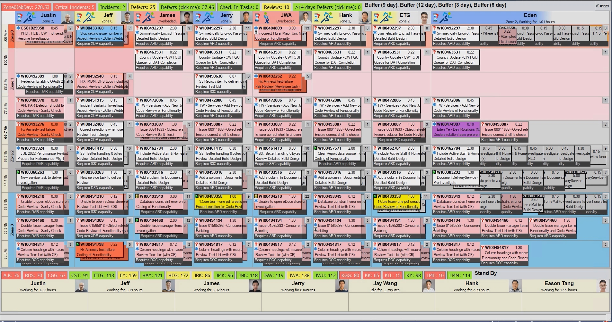

# 仿CargoWise PAVE界面实现

## GPT Prompt

我想要用C#实现一个Windows桌面端的工作流管理软件。
该软件的主要界面是一个面板，从左到右每列是一个员工，从下到上表示任务的剩余时间，初始时刻在最下方有若干未分配的任务卡片，
员工可以自由的申领任务，申领后任务卡片出现在对应员工的列中，任务卡片上显示任务的名称、简要描述、截止时间、紧急度、类型（普通需求、付费需求、Defect）、当前状态（调查中、实现中、Review中、单元测试中）在调查等信息。
并且随着时间的推移，任务会慢慢上升，直到到达截止时间。
该软件的次要界面是一个任务详情界面，点击主界面上的任务卡片可以查看任务的详细信息，并且可以在详细信息中编辑任务当前的状态。

目前，软件拟定采用的技术如下：
- C#
  - .Net Core 6.0：作为应用程序的运行时环境，提供必要的框架和库支持
    - 面向对象（继承、多态、接口）
    - 委托、事件
  - WPF (Windows Presentation Foundation)：用于开发桌面应用
  - MVVM (Model-View-ViewModel)：用于组织代码的设计模式
  - Entity Framework：用于操作数据库
  - Mysql：数据库

项目结构如下：
```
WorkflowManager （解决方案）
│
├── WorkflowManager.UI （WPF 项目，界面层）
│   ├── Views
│   │   ├── MainView.xaml  （主界面）
│   │   ├── TaskDetailView.xaml （任务详情界面）
│   ├── ViewModels
│   │   ├── MainViewModel.cs （主界面的 ViewModel）
│   │   ├── TaskDetailViewModel.cs （任务详情的 ViewModel）
│   ├── UserControls
│   │   ├── TaskCard.xaml  （任务卡片的 UI 定义）
│   └── Resources （资源文件，如样式、模板）
│
├── WorkflowManager.Core （业务逻辑和服务层）
│   ├── Models
│   │   ├── Task.cs （任务模型）
│   │   ├── Employee.cs （员工模型）
│   ├── Services
│   │   ├── TaskService.cs （任务服务）
│   │   ├── EmployeeService.cs （员工服务）
│   ├── Interfaces
│   │   ├── ITaskService.cs
│   │   ├── IEmployeeService.cs
│
├── WorkflowManager.Data （数据访问层）
│   ├── Repositories
│   │   ├── TaskRepository.cs （任务数据访问）
│   │   ├── EmployeeRepository.cs （员工数据访问）
│   ├── DatabaseContext.cs （Entity Framework 数据上下文）
│
└── db.sql （数据库脚本）
```

现在，你需要帮我根据src/db.sql中的数据库表和当前的项目设计，帮我在项目目录中创建对应的文件夹和文件。

## 项目介绍

使用C#实现的仿CargoWise PAVE界面，实现基本模块包括：

- 1. 界面设计
  - PAVE界面
  - WI界面
- 2. 数据库设计
  - 员工表
  - 任务表
- 3. 业务逻辑



## 设计技术

- C#
  - .Net Core 6.0：作为应用程序的运行时环境，提供必要的框架和库支持
    - 面向对象（继承、多态、接口）
    - 委托、事件
  - WPF (Windows Presentation Foundation)：用于开发桌面应用
  - MVVM (Model-View-ViewModel)：用于组织代码的设计模式
  - Entity Framework：用于操作数据库
  - Mysql：数据库

## 项目结构

```
WorkflowManager （解决方案）
│
├── WorkflowManager.UI （WPF 项目，界面层）
│   ├── Views
│   │   ├── MainView.xaml  （主界面）
│   │   ├── TaskDetailView.xaml （任务详情界面）
│   ├── ViewModels
│   │   ├── MainViewModel.cs （主界面的 ViewModel）
│   │   ├── TaskDetailViewModel.cs （任务详情的 ViewModel）
│   ├── UserControls
│   │   ├── TaskCard.xaml  （任务卡片的 UI 定义）
│   └── Resources （资源文件，如样式、模板）
│
├── WorkflowManager.Core （业务逻辑和服务层）
│   ├── Models
│   │   ├── Task.cs （任务模型）
│   │   ├── Employee.cs （员工模型）
│   ├── Services
│   │   ├── TaskService.cs （任务服务）
│   │   ├── EmployeeService.cs （员工服务）
│   ├── Interfaces
│   │   ├── ITaskService.cs
│   │   ├── IEmployeeService.cs
│
├── WorkflowManager.Data （数据访问层）
│   ├── Repositories
│   │   ├── TaskRepository.cs （任务数据访问）
│   │   ├── EmployeeRepository.cs （员工数据访问）
│   ├── DatabaseContext.cs （Entity Framework 数据上下文）
│
└── db.sql （数据库脚本）
```

## TODO

- 权限管理
- 自定义工作流
- 工作负载

## 坑点

- Mysql中数据库表的Type和Status字段默认存成了字符串类型，而C#中的枚举类型无法直接映射到字符串类型，需要自己写转换方法。
- 几个项目之间的依赖关系需要注意，核心在于Data层可以直接依赖Core层，但是Core层不能直接依赖Data层，这会导致循环依赖，解决方法是采用依赖注入的方式，在UI层告诉Core层中的服务类用到的接口在Data层的具体实现是什么。
- 窗口创建成功之后，出现不在我代码中的NullReference报错，原因是没有在App.xaml中指定窗口的关闭方法ShutdownMode
- 子控件绑定失败，原因是采用了Task.<属性名>，而实际采用<属性名>即可